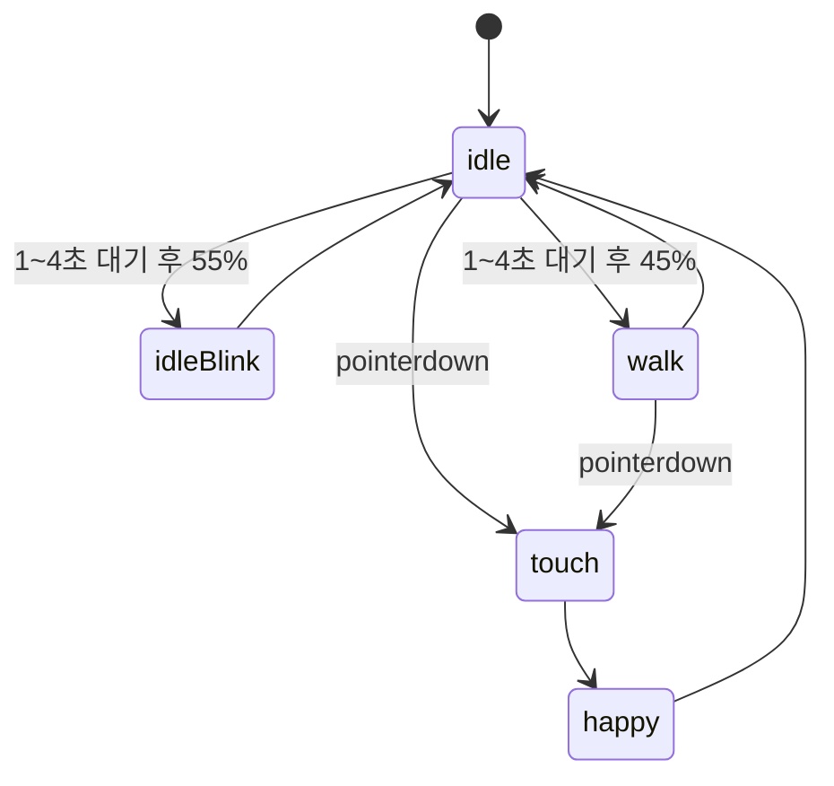

# 우리집 사슴벌레 프로젝트 분석

## 1. 프로젝트 요약

이 폴더는 브라우저에서 바로 실행되는 정적 웹 토이 프로젝트다. 사용자는 배경 화면 위에 있는 사슴벌레를 바라보고, 사슴벌레는 자동으로 깜빡이거나 걸어 다니며, 사용자가 터치하면 반응 애니메이션을 재생한다.

현재 구현은 빌드 도구나 프레임워크 없이 `index.html`, `css/style.css`, `js/main.js`, `assets/`만으로 구성되어 있다.

## 2. 현재 파일 구조

```text
StagBeetleToy/
├── index.html
├── css/
│   └── style.css
├── js/
│   └── main.js
├── assets/
│   ├── bg/
│   │   └── bg_main.png
│   ├── beetle/
│   │   ├── beetle_idle_01.png
│   │   ├── beetle_idle_02.png
│   │   ├── beetle_idle_03.png
│   │   ├── beetle_walk_01.png
│   │   ├── beetle_walk_02.png
│   │   ├── beetle_touch_01.png
│   │   ├── beetle_touch_02.png
│   │   ├── beetle_touch_03.png
│   │   ├── beetle_happy_01.png
│   │   ├── beetle_happy_02.png
│   │   ├── beetle_happy_03.png
│   │   ├── beetle_eat_oepn_01.png
│   │   ├── beetle_eat_oepn_02.png
│   │   ├── beetle_eat_oepn_03.png
│   │   ├── beetle_eat_oepn_04.png
│   │   ├── beetle_eat_chew_01.png
│   │   ├── beetle_eat_chew_02.png
│   │   └── jelly.png
│   ├── sound/
│   └── ui/
└── docs/
```

`assets/sound/`와 `assets/ui/`는 현재 비어 있으며, 사운드 효과와 UI 이미지 확장을 위한 자리로 보인다.

## 3. 런타임 동작

### 진입점

`index.html`은 전체 화면 게임 영역인 `#game_screen`과 사슴벌레 표시 영역인 `#beetle`을 만든다. 실제 이미지는 `#beetle_image`에 표시되고, 스크립트는 `js/main.js`에서 로드된다.

### 화면 배치

`css/style.css`는 다음 구조를 만든다.

- `body`: 여백 제거, 스크롤 숨김
- `#game_screen`: `100vw x 100vh` 전체 화면, `assets/bg/bg_main.png` 배경
- `#beetle`: 절대 위치, 기본 중앙 배치, 포인터 입력 가능
- `#beetle_image`: 폭 220px, 선택/드래그 방지

### 사슴벌레 상태 모델

`js/main.js`의 `beetle` 객체가 화면상의 사슴벌레 상태를 보관한다.

```js
const beetle = {
    x: 50,
    y: 50,
    state: "idle",
    direction: "right",
    currentFrame: 1
};
```

- `x`, `y`: 화면 안 위치, 퍼센트 단위
- `state`: 현재 애니메이션 상태
- `direction`: 좌우 방향
- `currentFrame`: 현재 프레임 번호, 1부터 시작

### 상태 흐름

현재 상태 흐름은 다음과 같다.



### 주요 애니메이션

- `idleBlink`: idle 프레임 `[2, 3, 2, 1]`, 100ms 간격
- `walk`: walk 1, 2번 프레임 반복, 180ms 간격
- `touch`: touch 프레임 `[1, 2, 3, 2, 1, 1, 1, 1, 1]`, 100ms 간격
- `happy`: happy 프레임 `[1, 2, 3, 2, 1, 2, 3, 2]`, 80ms 간격

### 이동 규칙

`startWalkState()`는 현재 위치에서 임의의 목표 위치를 정한다.

- X 이동량: 15~30%
- Y 이동량: 5~16%
- X 제한: 15~85%
- Y 제한: 20~80%
- 이동 시간: 2.5~4초

이동은 `requestAnimationFrame`으로 부드럽게 보간된다. 걷는 중 터치하면 현재 타이머와 이동 프레임을 정리하고 터치 반응으로 전환한다.

## 4. 애셋 현황

확인된 PNG 크기는 다음과 같다.

- 사슴벌레 프레임: 모두 `512 x 512`
- 젤리 이미지: `349 x 206`
- 배경 이미지: `1080 x 1920`

현재 코드에서 사용 중인 애셋은 `idle`, `walk`, `touch`, `happy`, `bg_main.png`이다. `eat`, `jelly`, `sound`, `ui`는 아직 구현에 연결되지 않았다.

주의할 점: 먹기 시작 프레임 파일명이 `beetle_eat_oepn_*.png`로 되어 있다. `open`의 오타로 보이지만, 현재 파일명이 실제 자산명이므로 코드를 추가할 때는 그대로 쓰거나 파일명 마이그레이션을 함께 처리해야 한다.

## 5. 강점

- 구조가 작고 명확해서 초보자도 흐름을 따라가기 쉽다.
- 상태와 프레임 정보가 `beetleFrames`, `animationSettings`, `beetle` 객체로 분리되어 있다.
- 포인터 이벤트를 사용해 마우스와 터치를 동시에 다룰 수 있다.
- 타이머와 `requestAnimationFrame`을 `clearTimers()`로 정리하는 기본 안전장치가 있다.

## 6. 현재 리스크와 개선 포인트

- 이미지 프레임을 미리 불러오지 않으므로 첫 재생 시 브라우저에 따라 살짝 끊김이 생길 수 있다.
- `#beetle_image` 폭이 220px로 고정되어 있어 아주 작은 화면에서는 위치 제한이 충분하지 않을 수 있다.
- 클릭 가능한 요소가 `div`라 키보드 접근성이 부족하다. 접근성을 올리려면 `button` 또는 `role`, `tabindex`, 키보드 이벤트가 필요하다.
- `playAnimation()` 자체는 시작 전에 기존 `frameTimer`를 정리하지 않는다. 현재 호출 흐름에서는 큰 문제는 없지만, 새 상태를 추가할 때는 상태 진입 함수에서 반드시 `clearTimers()`를 먼저 호출해야 한다.
- 먹이 주기용으로 보이는 `jelly`와 `eat` 애셋은 아직 사용되지 않는다.
- 빌드, 테스트, 린트 설정이 없으므로 변경 검증은 브라우저 수동 확인 중심이다.

## 7. 추천 개발 방향

우선순위가 높은 확장 후보는 다음과 같다.

1. 이미지 프리로드 추가
2. 젤리 클릭/드래그 기반 먹이 주기 구현
3. 먹기 상태 `eatOpen`, `eatChew` 연결
4. 모바일 화면에서 사슴벌레 크기 반응형 처리
5. 키보드 접근성 추가
6. 사운드 효과와 간단한 UI 버튼 추가
7. 기분, 배고픔, 친밀도 같은 디지털 펫 상태 추가

## 8. 실행 방법

가장 단순한 실행 방법은 `index.html`을 브라우저로 여는 것이다.

로컬 서버로 확인하려면 프로젝트 루트에서 다음 명령을 사용할 수 있다.

```powershell
python -m http.server 8000
```

그 다음 브라우저에서 `http://localhost:8000`을 열면 된다.
