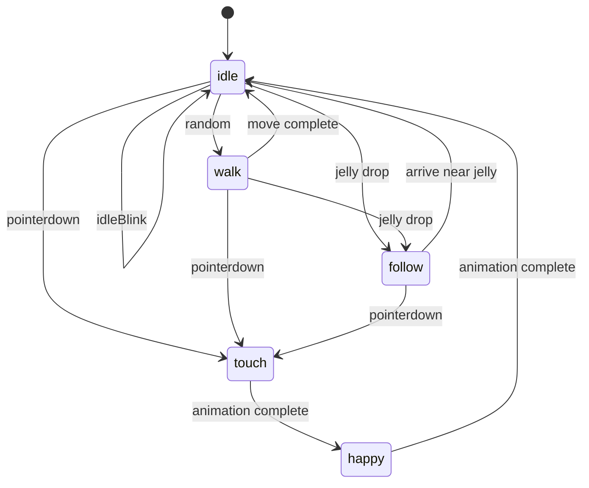

# 프로젝트 진행 상황

마지막 업데이트: 2026-07-09

## 프로젝트 목표

`우리집 사슴벌레`는 브라우저에서 바로 실행되는 작은 정적 웹 토이다. 사용자는 배경 위의 사슴벌레를 관찰하고 터치하며, 사슴벌레는 쉬기, 깜빡이기, 걷기, 터치 반응, 기분 좋은 반응을 통해 살아 있는 장난감처럼 보이도록 한다.

장기 목표는 젤리 먹이 주기, 감정 변화, 도망/회복 같은 작은 행동을 하나씩 추가해 단순하지만 오래 관리 가능한 디지털 펫으로 확장하는 것이다.

## 개발 환경

- 실행 방식: 정적 HTML/CSS/JavaScript
- 진입 파일: `index.html`
- 스타일 파일: `css/style.css`
- 동작 파일: `js/main.js`
- 빌드 도구: 없음
- 프레임워크: 없음
- 패키지 매니저: 없음
- 로컬 서버가 필요할 때: `python -m http.server 8000`

## 개발 철학

- 항상 브라우저에서 바로 실행 가능한 상태를 유지한다.
- 한 번에 하나의 작은 기능만 추가한다.
- 현재 구조를 최대한 유지하고, 복잡도가 실제로 커질 때만 파일을 나눈다.
- 초보자가 읽어도 상태 흐름을 따라갈 수 있는 코드를 우선한다.
- 애셋 경로와 프레임 번호 규칙을 안정적으로 관리한다.
- 큰 설계보다 작은 MVP를 먼저 완성한다.

## 현재 완료된 기능

- 전체 화면 게임 영역 표시
- 배경 이미지 표시
- 사슴벌레 이미지 중앙 배치
- 사슴벌레 현재 상태를 `beetle` 객체에서 관리
- `updateBeetleView()`를 통한 화면 갱신
- Idle 기본 상태
- Idle 중 랜덤 깜빡임
- Idle 중 랜덤 걷기 전환
- Walk 상태에서 퍼센트 좌표 기반 이동
- `requestAnimationFrame` 기반 이동 보간
- 이동 방향에 따른 좌우/상하 플립
- 사슴벌레 터치 입력 처리
- Touch 반응 후 Happy 애니메이션 연결
- 상태 전환 시 기존 타이머와 이동 프레임 정리
- 젤리 표시와 드래그 입력 처리
- 젤리 드래그 중 레이어를 가장 앞으로 보정
- 젤리 드롭 위치를 목표 좌표로 저장
- Follow 상태에서 사슴벌레가 젤리 근처까지 천천히 이동
- Follow 중 Walk 프레임 재사용
- Follow 도착 후 Idle 상태 복귀

## 현재 구현된 애니메이션

- Idle: 기본 대기 이미지와 깜빡임 애니메이션
- Walk: 2프레임 반복 걷기와 랜덤 이동
- Follow: Walk 2프레임을 재사용하는 젤리 방향 이동
- Touch: 터치했을 때 3프레임 왕복 반응
- Happy: Touch 뒤에 이어지는 3프레임 왕복 반응

아직 코드에 연결되지 않은 애니메이션 애셋은 다음과 같다.

- Eat(Open): `beetle_eat_oepn_01.png`부터 `beetle_eat_oepn_04.png`
- Eat(Chew): `beetle_eat_chew_01.png`, `beetle_eat_chew_02.png`

## 현재 리소스 현황

```text
assets/
├── bg/
│   └── bg_main.png
├── beetle/
│   ├── idle 3장
│   ├── walk 2장
│   ├── touch 3장
│   ├── happy 3장
│   ├── eat open 4장
│   ├── eat chew 2장
│   └── jelly.png
├── sound/
└── ui/
```

- 사슴벌레 프레임 PNG: 모두 `512 x 512`
- 젤리 이미지: `349 x 206`
- 배경 이미지: `1080 x 1920`
- `assets/sound/`: 현재 비어 있음
- `assets/ui/`: 현재 비어 있음

주의: 먹기 시작 프레임 파일명은 현재 `beetle_eat_oepn_*.png`이다. `open`의 오타처럼 보이지만 실제 파일명이므로, 코드에서 사용할 때는 그대로 쓰거나 파일명과 코드를 함께 마이그레이션해야 한다.

## 현재 코드 구조

```text
index.html
```

- `#game_screen`: 전체 화면 게임 영역
- `#beetle`: 사슴벌레 위치 컨테이너
- `#beetle_image`: 실제 사슴벌레 이미지

```text
css/style.css
```

- `body`: 여백 제거, 스크롤 방지
- `#game_screen`: 전체 화면 배경
- `#beetle`: 절대 위치, 포인터 입력 대상
- `#beetle_image`: 이미지 크기와 드래그 방지
- `#jelly`: 젤리 위치 컨테이너와 드래그 입력 대상
- `#jelly_image`: 젤리 이미지 크기와 드래그 방지

```text
js/main.js
```

- `beetleImageFolder`: 사슴벌레 이미지 경로
- `beetleFrames`: 상태별 이미지 파일 목록
- `animationSettings`: 프레임 순서와 지연 시간 규칙
- `LAYERS`: 기본 레이어와 드래그 중 젤리 레이어 값
- `beetle`: 현재 위치, 상태, 좌우/상하 플립, 프레임
- `jelly`: 현재 위치, 목표 위치, 드래그 상태
- `clearTimers()`: 기존 타이머와 이동 프레임 정리
- `playAnimation()`: 정해진 프레임 순서 재생
- `setJellyDraggingLayer()`: 젤리 드래그 시작/종료에 맞춰 레이어 전환
- `startIdleState()`: Idle 진입
- `startWalkState()`: Walk 진입
- `startFollowState()`: 젤리 목표 위치를 향한 Follow 진입
- `startTouchReaction()`: Touch와 Happy 반응 연결

## 현재 구현된 상태

`beetle.state`에 실제로 들어가는 상태는 다음 다섯 가지다.

- `idle`
- `walk`
- `follow`
- `touch`
- `happy`

현재 상태 흐름은 다음과 같다.



`idleBlink`는 별도 상태라기보다 `idle` 프레임을 사용하는 짧은 애니메이션이다.

## 현재 방향과 레이어 규칙

- 원본 사슴벌레 이미지는 왼쪽 방향 기준이다.
- 오른쪽 이동 시 `flipX`를 `-1`, 왼쪽 이동 시 `flipX`를 `1`로 둔다.
- 아래쪽 이동 시 `flipY`를 `-1`, 위쪽 이동 시 `flipY`를 `1`로 둔다.
- 화면 적용은 `translate(-50%, -50%) scale(flipX, flipY)` 형태로 한곳에서 조합한다.
- 기본 레이어 순서는 배경, 젤리, 사슴벌레다.
- 젤리를 드래그하는 동안에는 젤리만 가장 앞으로 올리고, 드래그가 끝나면 기본 레이어로 되돌린다.

## 다음 개발 목표

가장 가까운 목표는 젤리 먹이 주기 MVP를 만드는 것이다.

1. Eat(Open) 1회 재생 연결
2. Eat(Chew) 반복 재생 연결
3. 먹기 완료 후 Happy 또는 Idle로 복귀
4. 모바일 화면에서 크기와 터치 안정성 확인
5. 이미지 프리로드와 접근성 개선 검토
